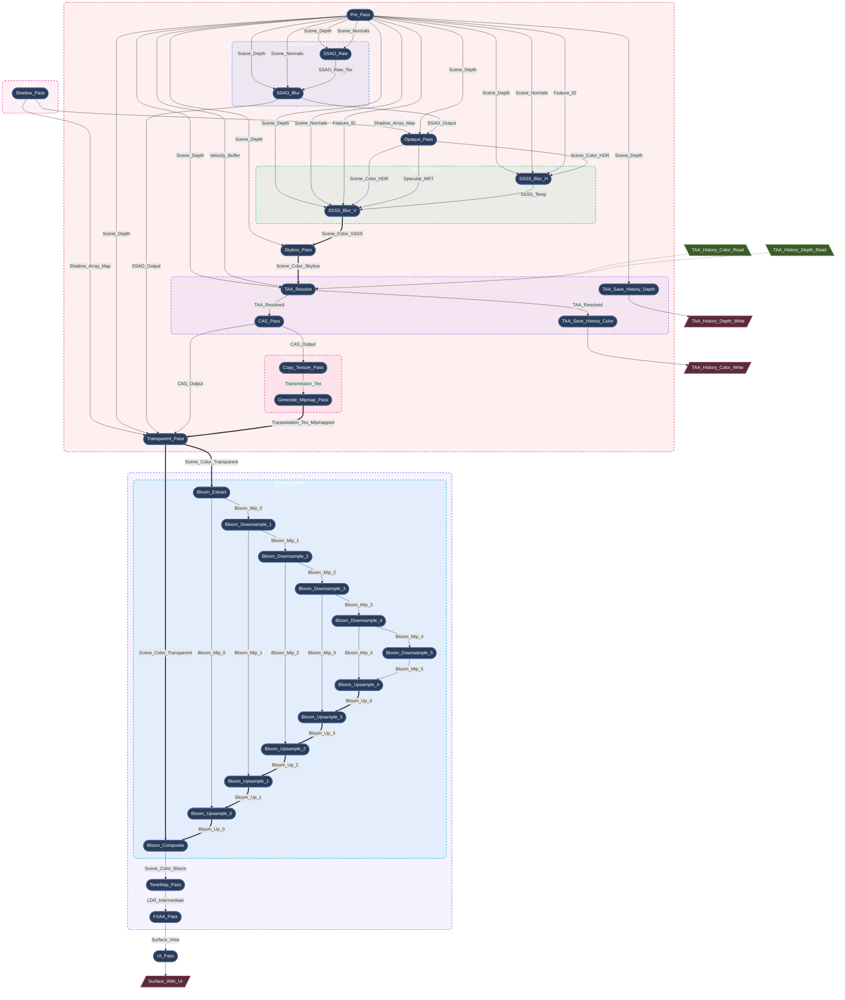

[中文](README_zh.md)

---
<div align="center">

# Myth

**A High-Performance, WGPU-Based Rendering Engine for Rust.**

[](https://github.com/panxinmiao/myth/actions/workflows/ci.yml)
[](https://github.com/panxinmiao/myth/actions/workflows/deploy.yml)
[](LICENSE)
[](https://gpuweb.github.io/gpuweb/)

[](https://panxinmiao.github.io/myth/showcase)

[**Gallery**](https://panxinmiao.github.io/myth) | [**Examples**](examples/)

</div>

---

> 📢 Status: Beta

> Myth is now in Beta. The core architecture is stable and ready for real-world use. APIs are still evolving, and occasional breaking changes may occur.

## Introduction

**Myth** is a developer-friendly, high-performance 3D rendering engine written in **Rust**. 

Inspired by the ergonomic simplicity of **Three.js** and built on the modern power of **wgpu**, Myth aims to bridge the gap between low-level graphics APIs and high-level game engines.

## Why Myth?

wgpu is incredibly powerful — but even a simple scene requires hundreds of lines of boilerplate.  
Bevy and Godot feel too heavy when you just want a lean rendering library.  

Myth solves this with a **strict SSA-based RenderGraph** that treats rendering as a compiler problem:
- Automatic topological sort + dead-pass elimination
- Aggressive transient memory aliasing (zero manual barriers)
- O(n) per-frame rebuild with zero allocations

**One codebase runs everywhere**:  
Native (Windows, macOS, Linux, iOS, Android) + WebGPU/WASM + Python bindings.


## Features

* **Core Architecture & Platform**
    * **True Cross-platform, One Codebase**: Native (Windows, macOS, Linux, iOS, Android) + WebGPU/WASM + Python bindings.
    * **Modern Backend**: Built on **wgpu**, fully supporting Vulkan, Metal, DX12, and WebGPU.
    * **SSA-based Render Graph**: A declarative, compiler-driven rendering architecture. You declare the topological needs, and the engine handles the rest:
        * **Automatic Synchronization**: Zero manual memory barriers or layout transitions.
        * **Aggressive Memory Aliasing**: Reuses transient high-resolution physical textures perfectly across distinct logical passes.
        * **Dead Pass Elimination**: Automatically culls rendering workloads.
        * **Zero-Allocation Per-Frame Rebuild**: Evaluates and compiles the entire DAG every frame.
    * **Headless & Offscreen Rendering** 
        * **Server-Side Ready**: Fully functional without a window surface. Perfect for CI/CD, cloud rendering, and offline video generation.
        * **High-Throughput Readback Stream**: Built-in non-blocking, asynchronous GPU-to-CPU pipeline with a ring-buffer architecture and automatic back-pressure. 

* **Advanced Rendering & Lighting**
    * **Physically Based Materials**: Robust PBR pipeline with Clearcoat, Iridescence, Transmission, Sheen, Anisotropy.
    * **Clustered Forward Lighting**: Compute-driven clustered light assignment for dense dynamic point/spot-light scenes in forward render passes.
    * **Image-Based Lighting (IBL)** + **Dynamic Shadows (CSM)**.
    * **SSAO / SSSS / Skybox**.
    * **Procedural Sky System**: Physically-based atmospheric scattering model (Hillaire 2020) with procedural celestial bodies (sun, moon, stars). Built-in `DayNightCycle` component for dynamic time progression, automatically syncing sun/moon/star trajectories.

* **Post-Processing & FX**
    * **HDR Pipeline** + **Bloom** + **Color Grading** + **TAA / FXAA / MSAA**.

* **3D Gaussian Splatting (3DGS)**
    * **Hybrid 3D Gaussian Splatting**: GPU-driven 3DGS path fully unified with the PBR RenderGraph.
    * **High Performance**: Custom GPU radix sort and indirect drawing for extreme rendering throughput.
    * **Physically Correct Compositing**: Accurate handling of sRGB/Linear color spaces for artifact-free blending with opaque geometry and post-processing (Bloom, Tone Mapping).

* **Assets & Tooling**
    * **Full glTF 2.0 Support** (PBR, animations, morph targets).
    * **Asynchronous Asset System** + **Embedded egui Inspector**.

## Under the Hood: The Graph Compiler

Myth uses a strict SSA-based RenderGraph, so the engine can:

* automatically schedule passes (topological order)
* eliminate unused work (dead-pass elimination)
* reuse memory aggressively (transient aliasing)

All without manual barriers.

Deep dive: [docs/RenderGraph.md](https://github.com/panxinmiao/myth/blob/main/docs/RenderGraph.md)

Here is an actual, auto-generated dump of Myth Engine's RenderGraph during a complex frame:

<details>
<summary><b>Click to expand the RenderGraph topology</b></summary>


*(* **Legend:** *Single arrow `-->` represents logical data dependency; Double arrow `==>` represents physical memory aliasing / in-place reuse)*
</details>

## Online Standalone Demo Apps

Experience the engine directly in your browser (Chrome/Edge 113+ required for WebGPU):

- **[Showcase (Home)](https://panxinmiao.github.io/myth/showcase)**: High-performance rendering showcase.
- **[glTF Viewer & Inspector](https://panxinmiao.github.io/myth/gltf_viewer)**: Drag & drop your own .glb files.
- **[glTF Sample Models](https://panxinmiao.github.io/myth/gltf_shower)**: Explore multiple official glTF assets from Khronos rendered with Myth.


## Quick Start

Add `myth-engine` to your `Cargo.toml`:

```toml
[dependencies]
myth-engine = "0.2.0"

# Or get the latest from GitHub
# myth-engine = { git = "https://github.com/panxinmiao/myth", branch = "main" }

```

### The "Hello World"

A spinning cube with a checkerboard texture in < 50 lines:

```rust
use myth::prelude::*;

struct MyApp;

impl AppHandler for MyApp {
    fn init(engine: &mut Engine, _: &dyn Window) -> Self {
        // 0. Create a Scene
        let scene = engine.scene_manager.create_active();

        // 1. Create a cube mesh with a checkerboard texture
        let tex_handle = engine.assets.checkerboard(512, 64);
        let mesh_handle = scene.spawn_box(
            1.0, 1.0, 1.0, 
            PhongMaterial::new(Vec4::new(1.0, 0.76, 0.33, 1.0)).with_map(tex_handle),
            &engine.assets,
        );
        // 2. Setup Camera
        let cam_node_id = scene.add_camera(Camera::new_perspective(45.0, 1280.0 / 720.0, 0.1));
        scene.node(&cam_node_id).set_position(0.0, 0.0, 5.0).look_at(Vec3::ZERO);
        scene.active_camera = Some(cam_node_id);
        // 3. Add Light
        scene.add_light(Light::new_directional(Vec3::ONE, 5.0));

        // 4. Setup update callback to rotate the cube
        scene.on_update(move |scene, _input, _dt| {
            if let Some(node) = scene.get_node_mut(mesh_handle) {
                let rot_y = Quat::from_rotation_y(0.02);
                let rot_x = Quat::from_rotation_x(0.01);
                node.transform.rotation = node.transform.rotation * rot_y * rot_x;
            }
        });
        Self {}
    }
}

fn main() -> myth::Result<()> {
    App::new().with_title("Myth-Engine Demo").run::<MyApp>()
}
```

### Run Examples

Clone the repository and run the examples directly:

```bash
# Run the examples (e.g., Earth demo)
cargo run --example earth --release

# Run standalone Apps (e.g., glTF Viewer)
cargo run -p gltf_viewer --release
```
For building and running Web/WASM examples, please refer to the [myth xtask Guide](xtask/README.md).

### Python Bindings
Myth Engine also provides Python bindings for rapid prototyping and scientific visualization.
See [Python Bindings](https://github.com/panxinmiao/myth/tree/main/bindings/python) for installation and examples.

## License

This project is licensed under the **MIT License** or **Apache-2.0 License**.