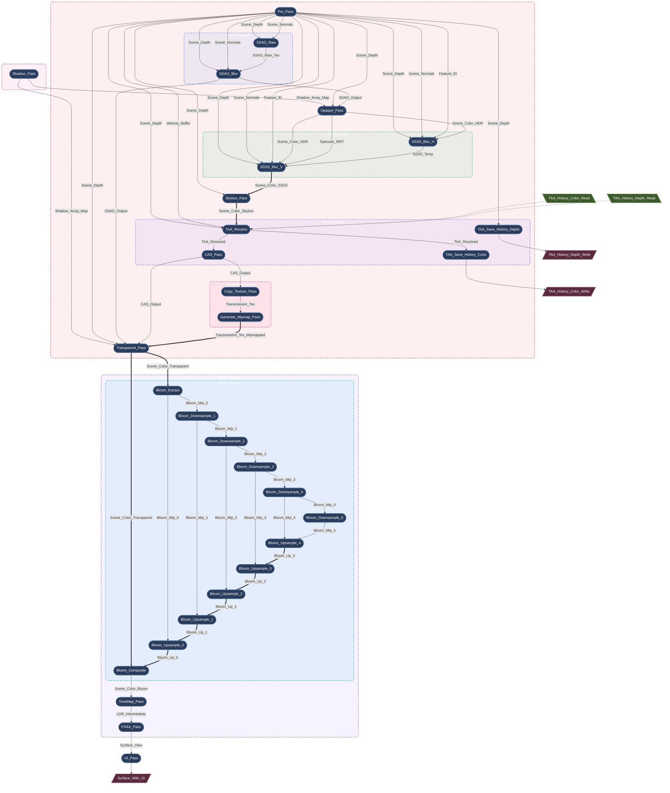

[English](README.md)

---
<div align="center">

# Myth

**基于 wgpu 的高性能 Rust 渲染引擎。**

[](https://github.com/panxinmiao/myth/actions/workflows/ci.yml)
[](https://github.com/panxinmiao/myth/actions/workflows/deploy.yml)
[](LICENSE)
[](https://gpuweb.github.io/gpuweb/)

[](https://panxinmiao.github.io/myth/)

[**📖 文档**](https://panxinmiao.github.io/myth/) | [**🖼️ 画廊**](https://panxinmiao.github.io/myth/gallery/) | [**💡 示例代码**](examples/)

</div>

---

> 📢 当前状态：Beta 阶段
>
> Myth 已进入 Beta 阶段。核心架构已趋于稳定，可用于实际项目。API 仍在演进过程中，可能会有不兼容的变更。

## 简介

**Myth** 是一款对开发者友好的、使用 **Rust** 编写的高性能 3D 渲染引擎。 

它深受 **Three.js** 简洁且符合直觉的 API 设计启发，并基于现代图形 API **wgpu** 构建。Myth 旨在弥合底层图形 API 与高层游戏引擎之间的鸿沟。

## 为什么选择 Myth？

wgpu 的功能极其强大 —— 但即使是绘制一个简单的场景，也需要编写数百行样板代码。  

而当你仅仅需要一个精简的渲染库时，Bevy 和 Godot 又显得过于笨重。  

Myth 通过引入**严格的基于 SSA（静态单赋值）的渲染图 (RenderGraph)** 解决了这个问题，它将渲染过程视为一个编译器问题：
- 自动拓扑排序 + 死阶段消除 (Dead-pass elimination)
- 激进的临时内存别名复用 (完全无需手动管理屏障)
- 复杂度为 O(n) 的每帧重建，且零内存分配

**一套代码，全平台运行**：  
原生 (Windows, macOS, Linux, iOS, Android) + WebGPU/WASM + Python 绑定。


## 核心特性

* **核心架构与平台**
    * **真正的跨平台，一套代码**：原生 (Windows, macOS, Linux, iOS, Android) + WebGPU/WASM + Python 绑定。
    * **现代后端**：基于 **wgpu** 构建，全面支持 Vulkan、Metal、DX12 和 WebGPU。
    * **基于 SSA 的渲染图**：声明式、由编译器驱动的渲染架构。你只需声明拓扑需求，引擎会处理剩下的所有事情：
        * **自动同步**：零手动内存屏障或布局转换。
        * **激进的内存别名**：在不同的逻辑阶段之间，完美复用高分辨率的临时物理纹理。
        * **死阶段消除**：自动剔除无用的渲染工作负载。
        * **零分配的每帧重建**：每帧都会对整个 DAG（有向无环图）进行评估与编译。
    * **无头与离线渲染**
        * **服务端就绪**：无需窗口表面 (Window Surface) 即可全功能运行。非常适合 CI/CD 自动化测试、云端渲染和离线视频生成。
        * **高吞吐量回读流**：内置基于环形缓冲区 (Ring-buffer) 架构的非阻塞、异步 GPU 到 CPU 像素回读管线，并带有自动背压 (Back-pressure) 与防 OOM 熔断机制。

* **高级渲染与光照**
    * **基于物理的材质 (PBR)**：强大的 PBR 管线，支持清漆 (Clearcoat)、彩虹色 (Iridescence)、透射 (Transmission)、光泽 (Sheen) 和各向异性 (Anisotropy)。
    * **集群前向光照**：通过 Compute Shader 为前向渲染通道预分配 cluster 光源列表，适用于高密度动态点光/聚光灯场景。
    * **基于图像的光照 (IBL)** + **动态阴影 (CSM)**。
    * **屏幕空间环境光遮蔽 (SSAO) / 屏幕空间反射 (SSR) / 屏幕空间全局光照 (SSGI) / 屏幕空间次表面散射 (SSSS) / 天空盒 (Skybox)**。
    * **程序化天空系统**：基于物理的散射模型 (Hillaire 2020)，支持程序化天体（太阳、月亮和星空）。内置昼夜循环组件，自动同步太阳、月亮和星空的轨迹。

* **后期处理与特效**
    * **HDR 管线** + **泛光 (Bloom)** + **色彩分级 (Color Grading)** + **TAA / FXAA / MSAA**。

* **3D 高斯溅射 (3D Gaussian Splatting)**
    * **混合式 3D 高斯溅射**：GPU 驱动的 3DGS 路径与 PBR RenderGraph 完全集成。
    * **高性能**：自定义 GPU 基数排序和间接绘制，实现极致的渲染吞吐量。
    * **物理正确的合成**：准确处理 sRGB/线性颜色空间，与不透明几何体和后期处理（Bloom、Tone Mapping）实现无瑕疵的混合。

* **资产与工具链**
    * **完整支持 glTF 2.0**（PBR、动画、变形目标）。
    * **异步资产系统** + **内嵌 egui 检查器**。

## 引擎底层：渲染图编译器 (The Graph Compiler)

Myth 使用了严格的基于 SSA 的 RenderGraph，因此引擎能够：

* 自动调度渲染阶段（拓扑排序）
* 消除未使用的渲染工作（死渲染过程消除）
* 激进地复用内存（瞬时别名复用）

所有这些都无需手动设置内存屏障。

深入了解：[构建基于 SSA 的声明式渲染图](https://panxinmiao.github.io/myth/blog/render-graph-design)

以下是 Myth 引擎在渲染复杂帧时，自动生成的 RenderGraph 的真实拓扑转储：

<details>
<summary><b>点击展开 RenderGraph 拓扑图</b></summary>



*(* **图例：** *单箭头 `-->` 表示逻辑数据依赖；双箭头 `==>` 表示物理内存别名/原地复用)*

</details>

## 在线独立展示应用

直接在你的浏览器中体验引擎（WebGPU 需要 Chrome/Edge 113+）：

  - **[画廊 Gallery](https://panxinmiao.github.io/myth/gallery/)**：在一处浏览全部示例与演示应用。
  - **[Showcase](https://panxinmiao.github.io/myth/gallery/showcase/)**：高性能渲染展示。
  - **[glTF 查看器与检查器](https://panxinmiao.github.io/myth/gallery/gltf_viewer/)**：拖拽你自己的 .glb 文件进行查看。
  - **[glTF 示例模型](https://panxinmiao.github.io/myth/gallery/gltf_shower/)**：浏览多个使用 Myth 渲染的 Khronos 官方 glTF 资产。

## 快速开始

将 `myth-engine` 添加到你的 `Cargo.toml` 中：

```toml
[dependencies]
myth-engine = "0.2.0"

# 或者从 GitHub 获取最新版本
# myth-engine = { git = "https://github.com/panxinmiao/myth", branch = "main" }

```

### "Hello World"

用不到 50 行代码，实现一个带有棋盘格纹理的旋转立方体：

```rust
use myth::prelude::*;

struct MyApp;

impl AppHandler for MyApp {
    fn init(engine: &mut Engine, _: &dyn Window) -> Self {
        // 0. 创建场景
        let scene = engine.scene_manager.create_active();

        // 1. 创建带有棋盘格纹理的立方体网格
        let tex_handle = engine.assets.checkerboard(512, 64);
        let mesh_handle = scene.spawn_box(
            1.0, 1.0, 1.0, 
            PhongMaterial::new(Vec4::new(1.0, 0.76, 0.33, 1.0)).with_map(tex_handle),
            &engine.assets,
        );
        // 2. 设置相机
        let cam_node_id = scene.add_camera(Camera::new_perspective(45.0, 1280.0 / 720.0, 0.1));
        scene.node(&cam_node_id).set_position(0.0, 0.0, 5.0).look_at(Vec3::ZERO);
        scene.active_camera = Some(cam_node_id);
        // 3. 添加光源
        scene.add_light(Light::new_directional(Vec3::ONE, 5.0));

        // 4. 设置更新回调以旋转立方体
        scene.on_update(move |scene, _input, _dt| {
            if let Some(node) = scene.get_node_mut(mesh_handle) {
                let rot_y = Quat::from_rotation_y(0.02);
                let rot_x = Quat::from_rotation_x(0.01);
                node.transform.rotation = node.transform.rotation * rot_y * rot_x;
            }
        });
        Self {}
    }
}

fn main() -> myth::Result<()> {
    App::new().with_title("Myth-Engine Demo").run::<MyApp>()
}
```

### 运行示例

克隆仓库并直接运行示例代码：

```bash
# 运行示例（例如 Earth 演示）
cargo run --example earth --release

# 运行独立应用（例如 glTF 查看器）
cargo run -p gltf_viewer --release
```
构建并运行Web/WASM示例，请参阅 [Myth xtask 指南](xtask/README_zh.md)

### Python 绑定

Myth 引擎还提供了 Python 绑定，用于快速原型设计和科学可视化。
有关安装方法和示例，请参阅 [Python Bindings](https://github.com/panxinmiao/myth/tree/main/bindings/python)。

## 开源协议

本项目采用 **MIT License** 或 **Apache-2.0 License** 双重授权。