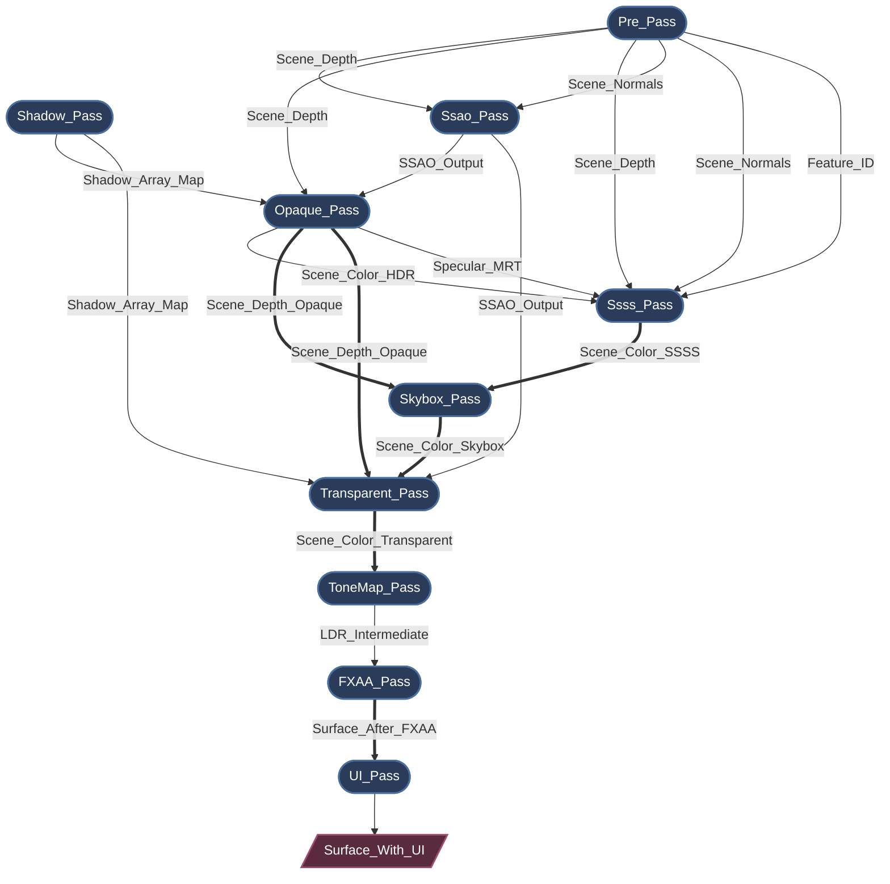
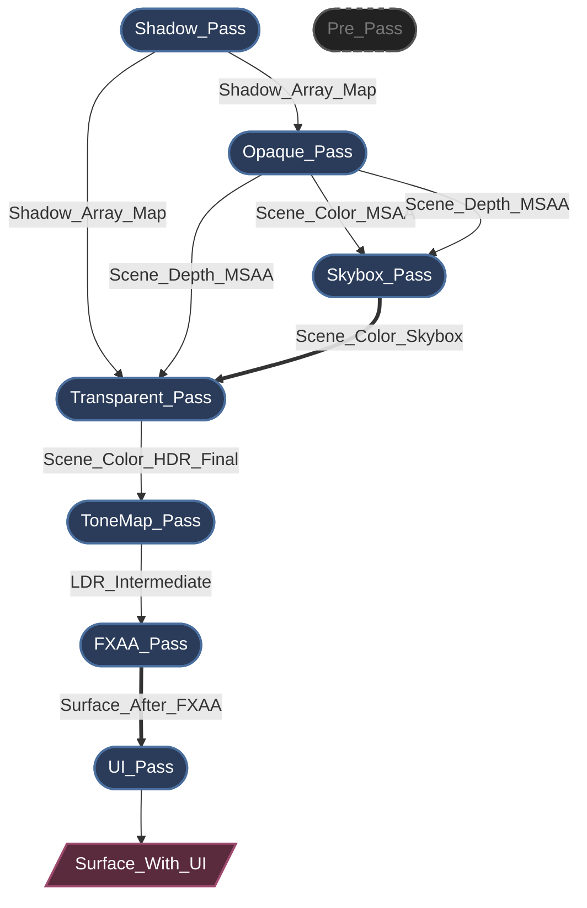
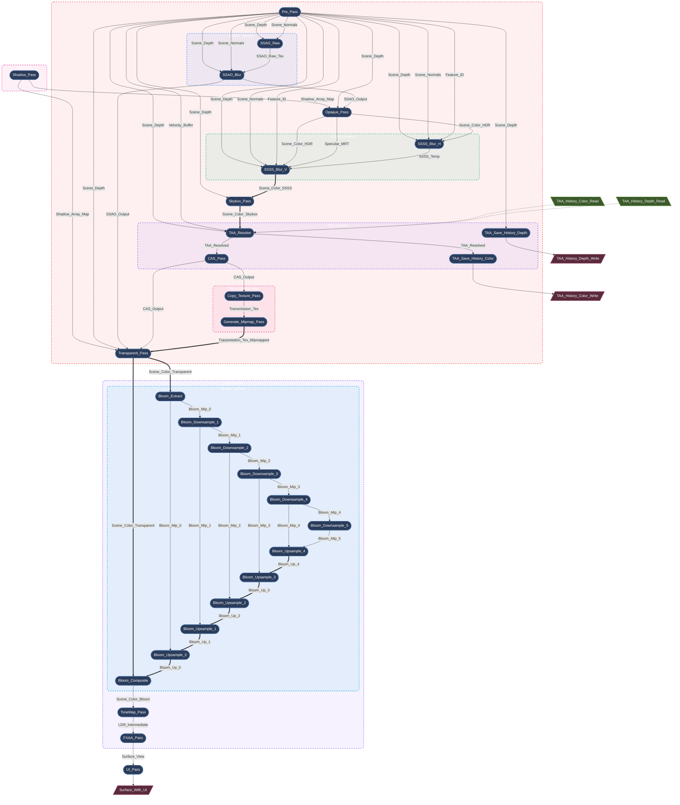

# Myth Engine 架构：构建基于SSA的声明式渲染图

## 0. 引言

现代图形 API（如 WebGPU、Vulkan 和 DirectX 12）赋予了开发者前所未有的 GPU 资源与同步控制能力。

但这种控制是有代价的。

一旦你的渲染器扩展到需要处理几个以上的渲染过程（RenderPass），你很快就会发现自己深陷于管理如下内容的泥潭之中：

*   资源生命周期
*   内存屏障
*   布局转换
*   瞬时内存分配
*   渲染顺序约束

如果没有强大的架构支撑，渲染管线很容易就会崩塌成一堆脆弱的状态管理代码。

在开发 **Myth Engine** 的过程中，我对此深有体会。每次添加新的渲染特性，都像是一场与状态管理的战斗，引擎的状态管理复杂度呈“指数级”上升。

虽然它“勉强能用”，但我不愿就此满足于“足够好”，并在底层积累技术债务。因此，我多次重构了这个子系统，经历了三次快速且方向性的架构调整，最终才得到当前的设计：一个基于 **SSA（静态单赋值，Static Single Assignment）** 的、**严格的、声明式的 RenderGraph**。

---

## 1. 通往 SSA 之路：快速的架构转向

### 转向 1: 硬编码原型

像许多引擎一样，最早的原型采用了一系列线性、硬编码的 `RenderPass` 调用。对于一个基础的前向渲染器来说，这写起来非常快。但是，当我开始添加级联阴影映射 (CSM) 和后处理特效时，它就开始显得力不从心了。

插入一个新的渲染过程，意味着要在主循环中手动重新连接整个 BindGroup。没过几天，我就意识到这种方法从根本上说是不可扩展的。

### 转向 2: “黑板”模式的尝试（手动连接）

许多技术文章提到现代渲染器是通过 “渲染图（RenderGraph）” 来管理渲染的，虽然大多只是寥寥几笔带过，但这确实给了我很大的启发。为了快速解耦各个RenderPass，我迅速转向了一种黑板（Blackboard）驱动的渲染图。各个渲染过程通过向一个以字符串为键的全局哈希映射（HashMap）中读写资源来进行通信。这种架构很容易理解和实现，并且成功地解耦了代码，但在开发过程中很快暴露了严重的架构缺陷：

*   **显存浪费：** 因为系统无法确切知道谁是资源的 *最后一个* 消费者，它不得不保守地延长资源生命周期（通常持续整个 frame）。动态分配的资源存活时间远超必要，完全错过了回收瞬时内存的机会，GPU 内存利用率极差。
*   **隐式数据流：** 因为渲染过程通过全局黑板键进行交互，它们实际的依赖关系被隐藏了。这使得无法静态分析真实的数据流，也无法安全地重排序渲染过程的执行。
*   **验证噩梦：** 在复杂的帧设置中，手动追踪资源生命周期、调整纹理的 `Load/Store` 操作、显式插入内存屏障，导致了无休止的 WGPU Validation Error。追踪渲染错误变成了一场噩梦。

### 转向 3：基于 SSA 的声明式渲染图（当前设计）

意识到 Blackboard 模式的致命问题后，我决定彻底重写 RenderGraph。

**一个 RenderGraph 不应该只是一个纹理 HashMap；它应该是一个编译器。**

类似思想出现在多个现代引擎中（如 Frostbite 的 Render Graph 和 Unreal Engine 的 RDG）。Unreal Engine 的 RDG 文档给了我很大的启发。Myth Engine 的 RDG 与这些系统理念类似，但在设计上更加严格地采用 **SSA (Static Single Assignment, 静态单赋值)** 。

通过这种架构，我们终于完全消除了手动资源管理。现在，RenderPass 只需声明它们的拓扑需求，例如：

```rust
builder.read_texture(id);
```
图编译器接收这个不可变的逻辑拓扑，并自动执行 **拓扑排序**、**自动生命周期管理**、**Dead Pass Elimination (DPE)** 以及 **激进的内存 aliasing**。

---

## 2. 核心理念：渲染中的严格 SSA

Myth Engine 的 RDG（Render Dependency Graph）的核心理念是 SSA。
SSA 常见于编译器设计中，其核心思想很简单：*每个变量只被赋值一次*。

在传统渲染中，一个 Pass 可能只是简单地“绑定一个纹理并绘制到它”。而在 SSA RenderGraph 中，一个逻辑资源（`TextureNodeId`）是严格不可变的。一旦一个 Pass 声明自己是某个资源的生产者，其他 Pass 绝对不能写入同一个逻辑 ID。

**但是，如果有多个 Pass 需要渲染到同一个屏幕缓冲区呢？**

为了不进行会破坏 DAG 拓扑的就地修改，我引入了 **别名（Aliasing）** 的概念（`mutate_texture`）。

当一个 Pass 需要执行“read-modify-write”操作时，它会消费前一个逻辑版本并产生一个 **新的** 逻辑版本。图编译器理解这个拓扑链，并保证在物理层面，**它们指向同一块物理 GPU 内存（即互为别名）。**

*（以下是现在 Myth Engine 中声明一个 Pass 的便捷性的快速预览：）*

```rust

let input_id = ...; // 某个现有的逻辑资源 ID
let input_id_2 = ...; // 某个现有的逻辑资源 ID

let pass_out = graph.add_pass("Some_Pass", |builder| {
    // 声明对输入资源的只读依赖。
    builder.read_texture(input_id);

    // 创建一个全新的资源。
    let output_texture = builder.create_texture("Some_Out_Res", TextureDesc::new(...));

    // 声明一个 alias 输入资源的新逻辑资源。（Read-Modify-Write）
    let output_texture_2 = builder.mutate_texture(input_id_2, "Some_Out_Res2", TextureDesc::new(...));

    let node = SomePassNode {
        input_texture: input_id,
        output_texture: output_texture,
        output_texture_2: output_texture_2,
    };
    (node, PassOut{output_texture, output_texture_2})
});

```

---

## 3. 生命周期：从声明到执行

RDG 的生命周期被严格划分为不同的阶段，确保 Pass 只在需要时精确地访问所需的数据：

1.  **Setup:** 在这个阶段，Pass 仅仅是数据包。它们使用 `builder.read_texture()` 和 `builder.create_texture()` 等方法声明依赖。此时，相关的帧内物理 GPU 资源还没创建。
2.  **Compilation:** 此时图编译器接管。它执行拓扑排序，计算精确的资源生命周期，剔除 dead passes，并使用激进的别名策略分配物理内存。所有必要的内存屏障都在这个阶段被自动推导出来。
3.  **Preparation:** 物理内存现已可用。Pass 获取它们的物理 `wgpu::TextureView` 并组装临时的 BindGroup。例如，`ShadowPass` 在此刻动态创建其基于层的 array views，完美地与静态资源管理器解耦。
4.  **Execution:** Pass 将命令录制到 `wgpu::CommandEncoder` 中。因为所有依赖和屏障都在编译期间完美解决，执行阶段完全无锁且非常快。

这种架构为引擎带来了巨大的性能和灵活性，同时大幅降低了开发新渲染特性时的摩擦。添加一个新的视觉效果不再是一次进入未知状态变化的冒险之旅；它只是一个简单的声明式操作。

---

## 4. 即时模式 vs. 保留模式

当讨论编译型 RenderGraph 时，一个设计问题不可避免地会出现：*图应该每帧重建并编译吗？还是引擎应该缓存图，并且只在拓扑结构改变时才重新编译？*

这两种方法代表了根本不同的架构理念：
*   **Retained / Cached graphs** — 追踪拓扑变化，仅在必要时重新编译。
*   **Immediate / Per-frame graphs** — 每帧都重建并编译图。

在 Myth Engine 中，我选择了 **每帧重建（per-frame rebuild）** 的方法。

得益于几个架构选择——特别是零分配编译（zero-allocation compilation）和缓存友好的数据布局——每帧重建图在实践中被证明既更简单，通常也更快。让我们来分析原因。

### 4.1 编译其实非常便宜
第一个误解是编译 RenderGraph 一定很昂贵。实际上，在 `compile_topology` 期间执行的工作非常轻量：
*   遍历连续的 `Vec` 存储来构建依赖边。
*   计算引用计数以进行无效过程剔除（Dead Pass Elimination）。
*   对几十个节点运行拓扑排序（Kahn’s algorithm）。
*   计算资源生命周期（`first_use` / `last_use`）。
*   从预分配的基于 slot 的池中重用物理纹理。

重要的是：
*   **无堆分配**
*   **无系统调用**
*   **纯整数运算和线性内存扫描**

#### 4.1.1 算法复杂度分析

整个编译过程可分为三个主要阶段，每个阶段都具有**线性或近似线性的时间复杂度**：

假设 $V$ = Pass 节点数， $E$ = 依赖边数， $R$ = 虚拟资源数：

* 拓扑排序（Kahn 算法）： $O(V + E)$

在渲染图中平均每个 Pass 一般仅有 2–3 个输入/输出， $E \approx 2.5V$，实际退化为 $O(V)$。

* 生命周期分析： $O(V)$

线性扫描拓扑排序后的节点数组，更新每个资源的 first_use / last_use。

* 资源池化分配： $O(R \log R)$ 或 $O(R)$

使用区间贪心分配（Interval Allocation）时需排序生命周期区间，但 $R$ 通常 < 100，此项在现代 CPU 上几乎等同于免费。

综合来看，整个 RenderGraph 编译路径均为严格线性扩展。随着Pass数量的增加，编译时间仅线性平缓增长，不会出现指数级的雪崩。

#### 4.1.2 性能基准：实测数据
以下是在我的电脑（CPU: Intel Core i9-9900K）上的实际基准测试数据（Criterion，12 个测试套件）：

- **单 Pass 边际开销稳定在 ~75 ns**：从 10 Pass 增加到 500 Pass，编译耗时从 0.8 µs 增至 37.7 µs，每增加一个 Pass 仅增加约 75 ns，完美验证了 $O(n)$ 线性度。
- **完整高保真管线仅 1.6 µs**：模拟当前引擎的真实渲染流程（Shadow + Prepass + SSAO + Opaque + Skybox + Bloom 5 级 + ToneMap + FXAA，共 19 Pass），单帧编译总耗时仅 1.6 微秒。
- **内存分配零成本**：基于 FrameArena 的分配器每次操作仅需 ~1.3 ns（纯指针 bump）

*（完整 12 组表格、线性链 / 扇入 / Dead-Pass Culling / FrameArena 等极端测试数据见文末附录 A）*

### 4.2 检测 Graph 变化可能更昂贵
如果我们想避免重新编译图，我们必须首先确定拓扑结构是否发生了变化。这产生了一个有趣的悖论。

为了检测变化，引擎每帧仍然必须重建当前的图描述。之后，它必须要么：
*   计算整个图的 hash。
*   或者对上一帧执行深层的结构性差异比较。

这两种方法都会引入自身的开销：hashing 字符串和描述符、不可预测的分支、非线性内存访问以及指针追逐（pointer chasing）。在实践中，这些操作消耗的 CPU 周期通常比简单地再次运行编译步骤还要多。

换句话说：**我们花费在检查是否应该编译上的时间比实际编译的时间还要多。**

### 4.3 立即模式极大简化了API设计
每帧方法最大的好处或许是开发使用体验。RenderGraph 代码在概念上变得类似于 immediate-mode UI 框架（例如imgui）。渲染管线每帧以声明式方式描述。

例如：
```rust
if ui.is_open() {
    graph.add_pass("UI_Blur", |builder| { ... });
}
```

动态渲染特性变得易于表达：

*   室内场景禁用 sunlight shadow passes。
*   UI 叠加插入临时的后处理。
*   动态分辨率缩放改变纹理大小。
*   可选效果（SSAO, bloom, motion blur）。

图编译器自动推导出正确的拓扑结构。如果系统依赖于 cached graphs，引擎就需要手动追踪拓扑失效、闭包捕获失效以及资源描述符不匹配。这会大大增加架构复杂性，并为诸如“陈旧资源”（stale resources）、“错误复用”（incorrect reuse） 或“悬空依赖”（dangling dependencies） 等细微 bug 打开大门。

对 Myth Engine 而言，结论很明确：**每帧重建和编译 RenderGraph 更简单、更安全，而且通常更（或同样）快。** 

### 4.4 与Rust语言特性的完美契合

在最新的重构中，RenderGraph 全面拥抱了 Rust 的生命周期系统，并利用Rust的语言特性实现了 **零运行时开销、零堆内存分配、零析构成本** 的渲染管线底层。

*  **纯正单帧生命周期 (`'a`)**：每一帧的渲染图都是瞬态的。所有渲染节点（PassNode）均在帧分配器（FrameArena）上进行 $O(1)$ 的线性分配。帧结束时，指针瞬间复位，不产生任何内存碎片。
*  **零成本物理借用**：渲染节点不再需要拥有外部资源（如 Arc 或持久化状态）的所有权。通过 `<'a>` 生命周期约束，节点可以直接安全地持有对外部状态或物理显存对象（如 wgpu::RenderPipeline）的内存借用。
*  **编译期 POD 断言**：引擎底层强制执行 `AssertNoDrop` 检查。任何试图向图内注入携带 String、Vec 或智能指针的节点的行为，都会在编译期被拒绝，从而保证执行期的绝对纯粹。
*  **执行期“零查找”**：将所有的 ID 解析、哈希寻址和变体计算提前至“组装期”与“准备期”，确保最终的 execute 阶段退化为一个纯粹的“机器码倾泻机”。

基于此，我还为 Frame Composer 提供了安全的 `add_custom_pass` 钩子系统。结合黑板（GraphBlackboard），外部程序可以在特定的钩子阶段 （HookStage）无痛挂载自定义瞬态节点，而无需感知底层设施的复杂性。

---

## 5. 案例研究：自动生成的图拓扑

以下是 Myth Engine 在不同 Render Path 配置下的 实时 Dump 出的 RenderGraph 。

> *注：引擎提供了一个实用方法，可以实时导出动态编译的拓扑和依赖关系，并以 `mermaid` 格式导出。这对于调试来说简直是救命稻草。*

### Case 1: 驯服复杂的依赖与内存别名

在一个具有屏幕空间环境光遮蔽 (SSAO) 和屏幕空间次表面散射 (SSSS) 的高度复杂场景中，依赖关系网会迅速变得混乱。



*(* **图例说明：** *单箭头 `-->` 代表逻辑数据依赖；双箭头 `==>` 代表物理内存别名 / 就地复用)*

*   **依赖解析:** SSSS 需要来自不同 Pass 中的 5 个不同输入。你只需为这些输入声明 `builder.read_texture()`。编译器保证执行顺序，并精确插入所需的 `ImageMemoryBarrier` 转换。
*   **内存别名:** 注意双箭头（`==>`）。追踪主颜色缓冲区：`Scene_Color_SSSS ==> Scene_Color_Skybox ==> Scene_Color_Transparent`。逻辑上，它们是完全不同的、不可变的资源。物理上，编译器智能地将它们的分配重叠到完全相同的、高分辨率的瞬时 GPU 纹理上。

### Case 2: Dead Pass Elimination ( DPE 死节点剔除 )

编译器不仅管理内存，它还能主动优化 GPU 工作负载。如果我们禁用 SSAO 和 SSSS，但启用硬件 MSAA 会发生什么？



*(* **图例说明：** *灰色虚线节点代表被编译器剔除的 dead passes)*

因为 MSAA 需要其自身的 multisampled depth buffer，`Opaque_Pass` 不再依赖于来自 `Pre_Pass` 的标准 depth buffer。随着 SSAO 和 SSSS 被禁用，没有活动的 Pass 消费 `Pre_Pass` 的输出。

图编译器在编译期间检测到这个零引用状态。它将 `P1(["Pre_Pass"])` 标记为 dead，自动绕过其物理内存分配、CPU preparation 和 GPU command recording。**零配置。**

---

## 6. 释放编译器的力量：打破“宏节点”

我很快发现了这种架构的强大力量。当我逐步将所有的 RenderPass 都移植到新系统后，它被证明是如此强大，以至于完全改变了我设计高级渲染特性的方式。

在此之前，像 Bloom、SSAO 或 SSSS 这样的复杂效果是作为“宏节点”编写的——内部自行分配 ping-pong 纹理并分派多个 draw calls 的 RDG 黑盒。

由于图编译器现在可以零成本地完美推导内存屏障和重叠的瞬时生命周期，我意识到我们不再需要这些黑盒了，编译器需要看到整个图的所有细节，才能执行更好的优化，发挥其全部能力。**我彻底将这些宏节点扁平化为原子的微过程（micro-passes）。** 一个 6-mip-level 的 Bloom 效果现在由 12 个完全独立的 RDG passes 组成。编译器现在可以“看到”每一个中间的 Mip 纹理，在下采样链、上采样链和其他后处理效果之间无缝地回收物理内存。

将这些“宏节点”完全展平并交予RenderGraph管理，会使得最终的RenderGraph变得非常复杂，但幸运的是，这完全是自动化的。你只需声明节点，编译器就会构建图。

为了在如此高度扁平的图中保持心智可管理性，我引入了**逻辑子图**。Pass 在像 `ctx.with_group("Bloom_System", |ctx| { ... })` 这样的块内编写。当启用 `rdg_inspector` 特性时，检查器会提取此元数据并生成漂亮的、递归嵌套的 Mermaid 流程图。

以下是 Myth Engine 渲染一个复杂场景的实时 Dump：


*（图例说明：单线箭头 `-->` 表示逻辑数据依赖；双线箭头 `==>` 表示物理内存别名/原位复用）*

通过这样做，我们充分释放了编译器的力量。每个 Pass 都是一个独立的原子单元。可以在全局范围内优化它们的执行顺序、内存分配和资源别名，而无需担心隐藏的副作用。同时，逻辑子图使开发者的认知负荷保持得完美可控。

另外，我还将一些常用的微Pass封装成了可重用的RenderNode节点，这使得构建一些复杂的调度逻辑就像搭积木一样简单。例如，MSAA、SSSS 和 Transmission 等特性的共存，曾经需要手动处理 MSAA Buffer 与单采样 Buffer 之间地狱般的来回转换，且难以达到最佳性能。现在，这一切都被渲染图编译器自动管理，变得简单而优雅。

这就是 SSA 声明式渲染图的力量：将复杂性交给编译器，把创造力还给渲染工程师。

---

<details>
<summary><b>附录 A：RenderGraph 编译性能基准测试（完整版）</b></summary>

所有 12 个基准测试均使用 **Criterion** 框架编写，在 Myth Engine 当前主分支上运行。测试环境为：Intel Core i9-9900K、32GB DDR5、Rust 1.92。

### 一、测试用例

| 文件                  | 作用 |
|-----------------------|------|
| `render_graph_bench.rs` | 完整 12 个基准测试套件（包含 500 Pass 极端测试） |

### 二、测试结果汇总

#### 1. 线性链 (LinearChain) — $O(n)$ 线性度验证
| Pass 数量 | 耗时（中位数） | 每 Pass 开销 | 倍率（实测 / 理论） |
|-----------|----------------|--------------|---------------------|
| 10        | 797 ns         | 79.7 ns      | —                   |
| 50        | 3.75 µs        | 75.0 ns      | 4.71× (5×)          |
| 100       | 7.53 µs        | 75.3 ns      | 9.45× (10×)         |
| 200       | 15.1 µs        | 75.6 ns      | 18.9× (20×)         |
| 500       | 37.7 µs        | 75.4 ns      | 47.3× (50×)         |

**结论**：完美 $O(n)$ 线性扩展，每 Pass 边际开销稳定 ~75 ns。

#### 2. 扇入拓扑 (Fan-In) — 高扇入压力测试
| 生产者数量 | 耗时     | 每 Pass 开销 |
|------------|----------|--------------|
| 10         | 1.03 µs  | 103 ns       |
| 50         | 4.75 µs  | 95.0 ns      |
| 100        | 9.84 µs  | 98.4 ns      |
| 200        | 21.4 µs  | 107 ns       |
| 500        | 69.5 µs  | 139 ns       |

**结论**：仍为严格 $O(n)$，500 个生产者汇聚时仅有轻微 SmallVec 开销。

#### 3. 钻石 DAG — 真实渲染管线拓扑
| 管线重复数 | Pass 总数 | 耗时    |
|------------|-----------|---------|
| 1          | 6         | 463 ns  |
| 5          | 26        | 1.58 µs |
| 10         | 51        | 2.94 µs |
| 20         | 101       | 6.00 µs |

**结论**：线性扩展，与实际场景高度吻合。

#### 4. SSA 别名中继链 (Alias Relay)
| 中继深度 | 耗时    | 每中继开销 |
|----------|---------|------------|
| 5        | 410 ns  | 82.1 ns    |
| 10       | 772 ns  | 77.2 ns    |
| 50       | 3.43 µs | 68.7 ns    |
| 100      | 6.76 µs | 67.6 ns    |
| 200      | 14.0 µs | 70.2 ns    |

**结论**：`mutate_texture` 路径完全线性，无额外复杂度。

#### 5. 死 Pass 剔除 (Dead-Pass Culling)
| 总 Pass 数 | 存活 Pass（10%） | 耗时   |
|------------|------------------|--------|
| 50         | 5                | 2.46 µs|
| 100        | 10               | 5.02 µs|
| 200        | 20               | 10.6 µs|
| 500        | 50               | 26.8 µs|

**结论**：mark-and-sweep 与总 Pass 数线性无关，与存活比例无关。

#### 6. FrameArena 分配吞吐量
| 分配次数 | 耗时     | 单次开销     |
|----------|----------|--------------|
| 100      | 124 ns   | **1.24 ns**  |
| 500      | 682 ns   | **1.36 ns**  |
| 1,000    | 1.38 µs  | **1.38 ns**  |
| 5,000    | 6.90 µs  | **1.38 ns**  |

**结论**：纯 bump 分配器，相比 `malloc` 快约 50 倍，生命周期借用零开销。

#### 7. 多帧容量复用 (Steady-State)
| 场景               | 耗时    |
|--------------------|---------|
| 100 Pass 稳态帧    | **7.30 µs** |


#### 8. Side-Effect Pass
| 总 Pass 数 | 耗时    |
|------------|---------|
| 10         | 625 ns  |
| 50         | 2.99 µs |
| 100        | 6.20 µs |
| 200        | 12.8 µs |

**结论**：与常规 Pass 混合无任何性能退化。

#### 9. HighFidelity 全管线
模拟引擎当前真实的 High-Fidelity 渲染管线（Shadow + Prepass + SSAO + Opaque + Skybox + Transparent + Bloom 展平 10 个 Pass + ToneMap + FXAA，共 **19 个 Pass**）：

| 场景           | 耗时    |
|----------------|---------|
| 完整 HiFi 管线 | **1.61 µs** |

**结论**：每帧纯 CPU 开销仅 **1.61 微秒**，占 60 fps 帧预算 **0.0096%**。

#### 10. 构建 vs 编译分离度量
| Phase          | 50 Pass | 100 Pass | 500 Pass |
|----------------|---------|----------|----------|
| Build Only     | 1.97 µs | 3.91 µs  | 20.4 µs  |
| Build + Compile| 3.65 µs | 7.27 µs  | 37.9 µs  |
| **Compile Only** | **1.68 µs** | **3.36 µs** | **17.5 µs** |

**结论**：构建与编译开销几乎 1:1 均分，两者均为 $O(n)$。

### 三、关键数据总结

| 指标               | 数值                  |
|--------------------|-----------------------|
| 单 Pass 边际开销   | ~75 ns                |
| FrameArena 单次分配| ~1.3 ns               |
| 实际 HiFi 管线开销 | **1.61 µs**           |
| 帧预算占比 (60 fps)| **< 0.01%**           |
| 算法复杂度         | 所有路径均为 $O(n)$   |
| 方差/抖动          | 极低（异常值 < 10%）  |

**最终结论**：Myth Engine 的 RenderGraph 在理论与实测上均实现严格线性扩展，从 10 Pass 到 500 Pass 无任何性能雪崩，为 Immediate/Per-frame 架构提供了坚实的数据支撑。

</details>