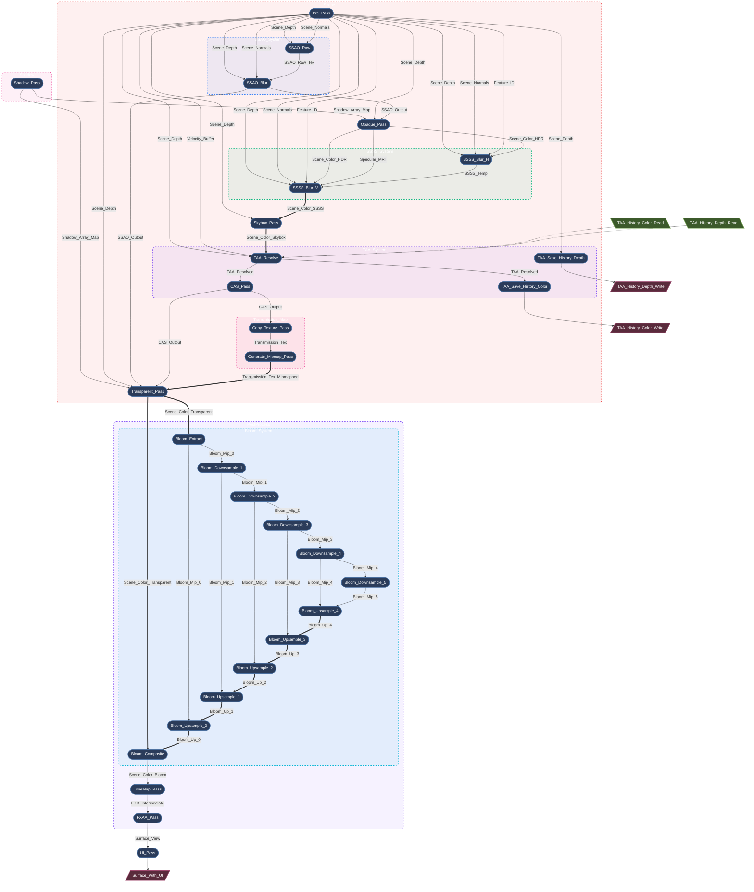

# Render Graph：基于 SSA 的声明式渲染图

现代图形 API 赋予了开发者前所未有的 GPU 资源与同步控制能力。但这种控制是有代价的。一旦渲染器需要处理复杂的特效链，开发者很容易深陷于管理资源生命周期、内存屏障和瞬时内存分配的泥潭之中。

Myth Engine 的核心竞争力之一，就是内置了一个**基于 SSA（静态单赋值）的、严格的、声明式的渲染图编译器 (Render Dependency Graph, 简称 RDG)**。

## 1. 核心理念：严格的 SSA 架构

一个 RenderGraph 不应该只是一个用来共享纹理的 HashMap；它应该是一个**编译器**。

Myth 的 RDG 核心思想来源于编译器设计中的 **SSA (Static Single Assignment, 静态单赋值)**：*每个变量只被赋值一次*。在传统的渲染中，一个 Pass 可能会“绑定一个纹理并原位绘制修改它”。而在 Myth 的 SSA 架构中，逻辑资源（`TextureNodeId`）是严格不可变的。

**如何处理原位修改 (Read-Modify-Write)？**
我们引入了 **别名 (Aliasing)** 的概念：
当一个 Pass 需要修改纹理时，它会消费前一个逻辑版本并产生一个 **新的** 逻辑版本。图编译器理解这个拓扑链，并保证在物理层面，**它们指向同一块物理 GPU 内存**。

```rust
let pass_out = graph.add_pass("Some_Pass", |builder| {
    // 声明对输入资源的只读依赖
    builder.read_texture(input_id);
    
    // 声明一个 alias 输入资源的新逻辑资源 (Read-Modify-Write)
    let output_texture = builder.mutate_texture(input_id, "Some_Out_Res", TextureDesc::new(...));
    
    // ...
});

```

## 2. 编译器的魔法：零开销、全自动

图编译器的生命周期被严格划分为：**Setup (声明) -> Compilation (编译) -> Preparation (准备) -> Execution (执行)**。

通过这种架构，引擎自动为你完成了极其复杂的底层优化：

### 自动内存别名 (Memory Aliasing)

在复杂的后处理管线中，逻辑上完全不同且不可变的资源，编译器会智能地将它们的分配重叠到完全相同的临时 GPU 纹理上。零显存浪费。

### 死节点剔除 (Dead Pass Elimination, DPE)

如果我们禁用了某些高级特效（例如 SSAO），其前置的依赖节点（如仅仅为了 SSAO 存在的 Normal Pre-pass）会变成零引用状态。编译器在编译期间会自动检测并将其标记为 Dead，自动绕过其物理内存分配和 GPU 命令录制。**全程零配置。**

### 零分配的即时编译

Myth 选择了**每帧重建 (per-frame rebuild)** 图的策略。
由于采用了 `FrameArena` 纯 bump 分配器和高度优化的数据结构，单帧编译总耗时在复杂场景下仅约 **1.6 微秒**（占 60fps 帧预算不到 0.01%），实现了真正的 $O(n)$ 线性扩展，免去了维护庞大拓扑缓存带来的潜在 Bug。

## 3. 动态拓扑可视化

Myth 引擎支持在运行时实时 Dump 渲染图拓扑。以下是开启多项后处理的高保真渲染管线 (High-Fidelity) 自动生成的局部图谱：

*(注：单箭头 `-->` 代表逻辑数据依赖；双箭头 `==>` 代表物理内存别名 / 就地复用)*



将复杂性交给编译器，把创造力还给渲染工程师。这就是 Myth RDG 的力量。

