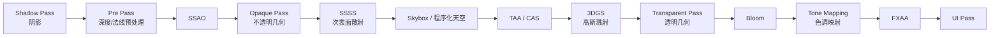

# 渲染路径与帧合成

在深入 Render Graph 的底层机制之前，理解 Myth 的**渲染路径 (Render Path)** 与**帧合成器 (Frame Composer)** 有助于你建立全局视角：一帧画面究竟由哪些阶段、按什么顺序组装而成。

## 1. 两条渲染路径

引擎在创建 `App` 时通过 `RendererSettings` 选择渲染路径：

```rust
App::new()
    .with_title("My App")
    .with_settings(RendererSettings {
        path: RenderPath::HighFidelity,
        ..Default::default()
    })
    .run::<MyApp>()
```

| 渲染路径 | 定位 | 适用场景 |
| :--- | :--- | :--- |
| `RenderPath::HighFidelity` | 完整的 PBR + 后处理 + 屏幕空间特效 + 3DGS 管线 | 桌面 / 高端设备，需要 Bloom、SSAO、SSR、SSGI、TAA、3DGS 等特性 |
| `RenderPath::BasicForward` | 极简前向渲染 | 低端设备、移动端，仅需基础着色 |

::: warning 特性依赖
绝大多数高级特性（Bloom、SSAO、SSR、SSGI、SSSS、TAA、3DGS）都依赖 `HighFidelity` 路径。若发现某个后处理“不生效”，请先确认渲染路径设置正确。
:::

## 2. 高保真帧的合成顺序

`HighFidelity` 路径下，帧合成器 (`FrameComposer`) 按下列拓扑顺序组装各个阶段。每个阶段都会向 Render Graph 声明其资源依赖，由编译器统一调度：



各阶段要点：

- **Shadow Pass：** 为投射阴影的方向光生成级联阴影贴图 (CSM)，聚光灯生成独立阴影。
- **Pre Pass：** 提前写入场景深度、法线与速度缓冲，供 SSAO、SSSS、TAA 等屏幕空间特效复用。
- **Opaque Pass：** PBR 不透明几何的主着色阶段，在此进行聚类光照查找。
- **SSSS：** 基于屏幕空间的次表面散射，依赖 Pre Pass 的法线与 Feature ID。
- **3DGS：** 高斯溅射读取不透明深度缓冲，实现与传统几何的正确遮挡（仅在启用 `3dgs` 特性时存在）。
- **Bloom → Tone Mapping → FXAA：** HDR 后处理链，最终输出到屏幕。

::: tip 自动剔除
上述阶段并非每帧全部执行。若某个特效被关闭（例如 SSAO），编译器会自动剔除它及其唯一为它服务的前置节点（死节点剔除），完全零配置。详见 [Render Graph 渲染图](/architecture/render-graph)。
:::

## 3. 在合成流程中注入自定义阶段

帧合成器提供了**钩子系统 (Hook System)**，允许你在标准阶段之间插入自定义的 Render Graph 节点，而无需修改引擎源码：

```rust
// 在后处理之前插入自定义全屏特效
composer.add_hook(HookStage::BeforePostProcess, move |ctx| {
    // 向 ctx.graph 声明并返回你的自定义 Pass
});
```

这套机制让自定义后处理、调试可视化、GPU 数据生成等工作都能零副作用地嵌入主循环。详见 [自定义 Shader 与后处理](/advanced/custom-shader)。

## 下一步

- 深入编译器底层 → [Render Graph 渲染图](/architecture/render-graph)
- 配置各项后处理特效 → [后处理与屏幕空间特效](/advanced/post-processing)
