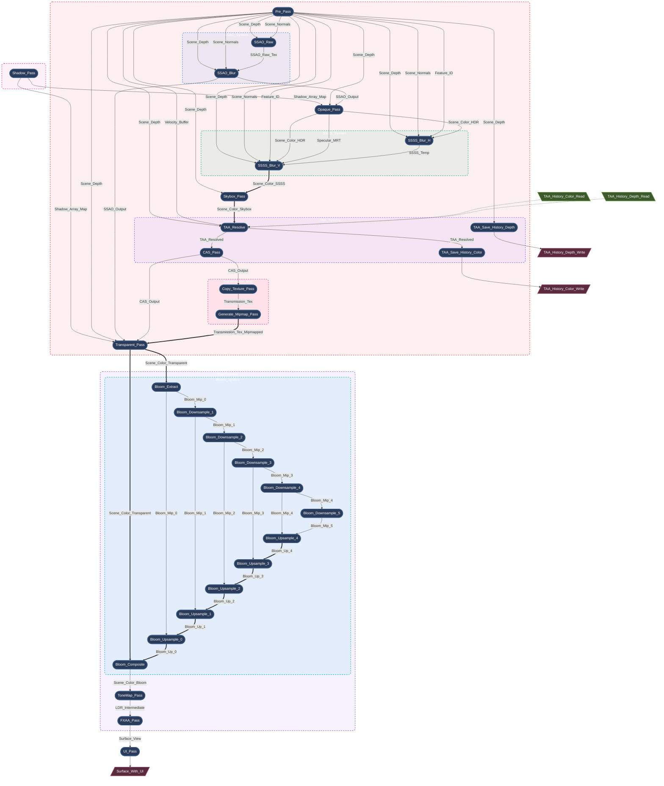

# Render Graph: A Declarative, SSA-based Compiler

Modern graphics APIs give developers unprecedented control over GPU resources and synchronization. But that control comes at a price. Once a renderer needs to handle a chain of complex effects, it's easy to drown in managing resource lifetimes, memory barriers, and transient allocations.

One of Myth Engine's core strengths is a built-in **strict, declarative Render Dependency Graph (RDG) compiler based on SSA (Static Single Assignment)**.

## 1. Core Idea: A Strict SSA Architecture

A RenderGraph should not be just a HashMap for sharing textures; it should be a **compiler**.

Myth's RDG is rooted in **SSA** from compiler design: *each variable is assigned exactly once*. In traditional rendering, a pass might "bind a texture and draw into it in place." In Myth's SSA architecture, a logical resource (`TextureNodeId`) is strictly immutable.

**How do we handle Read-Modify-Write?**
We introduce the concept of **aliasing**:
when a pass needs to modify a texture, it consumes the previous logical version and produces a **new** logical version. The graph compiler understands this topological chain and guarantees that, at the physical level, **they point to the same physical GPU memory**.

```rust
let pass_out = graph.add_pass("Some_Pass", |builder| {
    // Declare a read-only dependency on the input resource
    builder.read_texture(input_id);

    // Declare a new logical resource aliasing the input (Read-Modify-Write)
    let output_texture = builder.mutate_texture(input_id, "Some_Out_Res", TextureDesc::new(...));

    // ...
});
```

## 2. Compile-Time Optimization: Zero-Overhead, Fully Automatic

The compiler's lifecycle is strictly divided into: **Setup (declaration) → Compilation → Preparation → Execution**.

Through this architecture, the engine performs extremely complex low-level optimizations for you automatically:

### Automatic Memory Aliasing

In a complex post-processing pipeline, the compiler intelligently overlaps logically distinct, immutable resources onto the exact same transient GPU texture. Zero VRAM waste.

### Dead Pass Elimination (DPE)

If we disable certain advanced effects (e.g. SSAO), their upstream dependency nodes (such as a Normal Pre-pass that existed only for SSAO) become zero-referenced. During compilation the compiler detects this and marks them Dead, automatically bypassing their physical memory allocation and GPU command recording. **Zero configuration throughout.**

### Zero-Allocation Just-in-Time Compilation

Myth opts for a **per-frame rebuild** strategy.
Thanks to a `FrameArena` pure bump allocator and highly optimized data structures, total per-frame compilation takes only about **1.6 microseconds** in complex scenes (less than 0.01% of a 60fps frame budget), achieving true $O(n)$ linear scaling and avoiding the latent bugs of maintaining a giant topology cache.

## 3. Dynamic Topology Visualization

Myth can dump the render graph topology live at runtime. Below is a partial, auto-generated graph of the High-Fidelity pipeline with multiple post-processing effects enabled:

*(Note: a single arrow `-->` represents a logical data dependency; a double arrow `==>` represents physical memory aliasing / in-place reuse.)*



Leave the complexity to the compiler, and give the creativity back to the rendering engineer. That is the power of Myth's RDG.
