# Render Paths & Frame Composer

Before diving into the internals of the Render Graph, understanding Myth's **render paths** and **frame composer** helps you build a global picture: which stages assemble a frame, and in what order.

## 1. Two Render Paths

The engine selects a render path via `RendererSettings` when creating an `App`:

```rust
App::new()
    .with_title("My App")
    .with_settings(RendererSettings {
        path: RenderPath::HighFidelity,
        ..Default::default()
    })
    .run::<MyApp>()
```

| Render Path | Role | Use Case |
| :--- | :--- | :--- |
| `RenderPath::HighFidelity` | Full PBR + post-processing + screen-space FX + 3DGS pipeline | Desktop / high-end devices needing Bloom, SSAO, SSR, SSGI, TAA, 3DGS, etc. |
| `RenderPath::BasicForward` | Minimal forward rendering | Low-end devices, mobile, basic shading only |

::: warning Feature Dependencies
Most advanced features (Bloom, SSAO, SSR, SSGI, SSSS, TAA, 3DGS) depend on the `HighFidelity` path. If a post-processing effect "doesn't work," first confirm the render path is set correctly.
:::

## 2. High-Fidelity Frame Composition Order

On the `HighFidelity` path, the `FrameComposer` assembles each stage in the following topological order. Each stage declares its resource dependencies to the Render Graph, which schedules them uniformly:

```mermaid
flowchart LR
    A[Shadow Pass] --> B[Pre Pass<br/>Depth/Normals]
    B --> C[SSAO]
    C --> D[Opaque Pass]
    D --> E[SSSS<br/>Subsurface]
    E --> F[Skybox / Procedural Sky]
    F --> G[TAA / CAS]
    G --> H[3DGS<br/>Gaussian Splatting]
    H --> I[Transparent Pass]
    I --> J[Bloom]
    J --> K[Tone Mapping]
    K --> L[FXAA]
    L --> M[UI Pass]
```



Key points per stage:

- **Shadow Pass:** Generates Cascaded Shadow Maps (CSM) for shadow-casting directional lights, and separate shadows for spot lights.
- **Pre Pass:** Writes scene depth, normals, and velocity buffers ahead of time, reused by screen-space effects like SSAO, SSSS, and TAA.
- **Opaque Pass:** The main shading stage for PBR opaque geometry, where clustered light lookups happen.
- **SSSS:** Screen-space subsurface scattering, depending on Pre Pass normals and Feature ID.
- **3DGS:** Gaussian splatting reads the opaque depth buffer for correct occlusion against traditional geometry (present only when the `3dgs` feature is enabled).
- **Bloom → Tone Mapping → FXAA:** The HDR post-processing chain, finally output to screen.

::: tip Automatic Culling
Not all of these stages run every frame. If an effect is disabled (e.g. SSAO), the compiler automatically culls it and any predecessor nodes that exist solely to serve it (dead-pass elimination), with zero configuration. See [Render Graph](/en/architecture/render-graph).
:::

## 3. Injecting Custom Stages

The frame composer provides a **hook system** that lets you insert custom Render Graph nodes between standard stages without modifying engine source:

```rust
// Insert a custom full-screen effect before post-processing
composer.add_hook(HookStage::BeforePostProcess, move |ctx| {
    // Declare and return your custom pass on ctx.graph
});
```

This mechanism lets custom post-processing, debug visualization, and GPU data generation embed into the main loop with zero side effects. See [Custom Shaders & Post FX](/en/advanced/custom-shader).

## Next Steps

- Go deep into the compiler internals → [Render Graph](/en/architecture/render-graph)
- Configure post-processing effects → [Post-Processing & Screen-Space FX](/en/advanced/post-processing)
