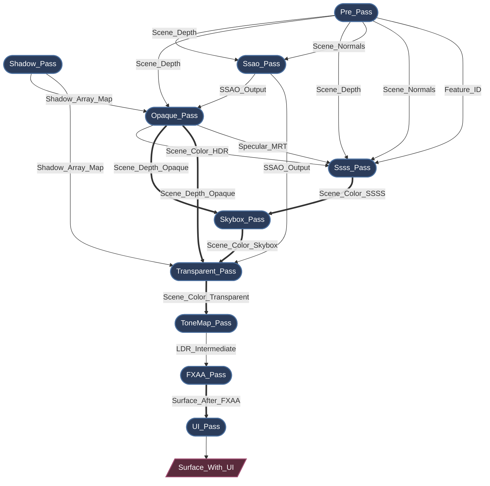
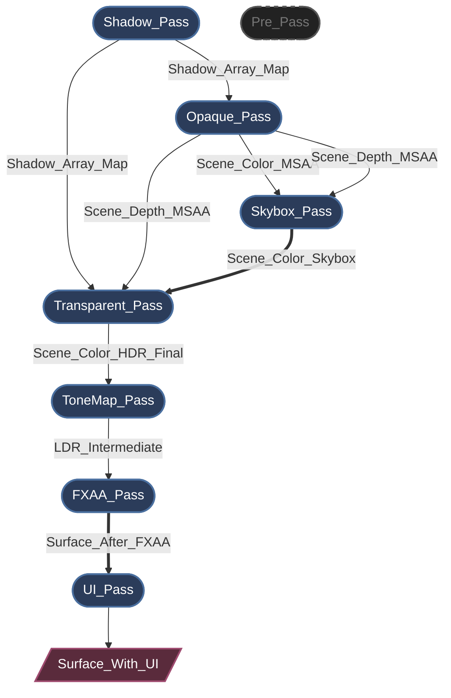
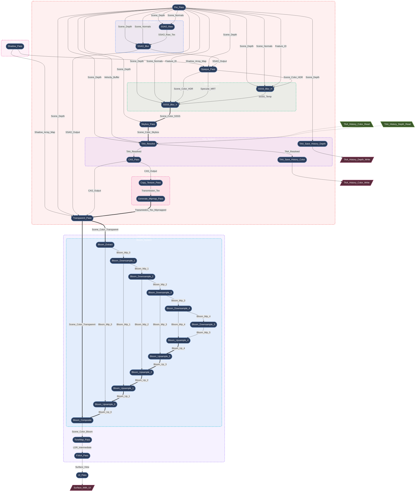

# Myth Engine Architecture: Building an SSA-Based Declarative Render Graph

*(Note: The original text was written in Chinese and translated and polished into English.)*

## 0. Introduction

Modern graphics APIs (like WebGPU, Vulkan, and DirectX 12) give developers unprecedented control over GPU resources and synchronization.

But this control comes at a cost.

Once your renderer scales beyond a handful of RenderPasses, you quickly find yourself bogged down in a swamp of manual state management:

* Resource lifecycles
* Memory barriers
* Layout transitions
* Transient memory allocations
* Render order constraints                       

Without a robust architectural foundation, a rendering pipeline can easily collapse into a fragile mess of state management code.

During the development of **Myth Engine**, I experienced this firsthand. Every new rendering feature felt like a battle against state management, and the complexity of managing state grew exponentially.

It “kind of worked,” but I didn’t want to settle for “good enough” and accumulate technical debt at the foundation. So I refactored this subsystem many times, going through three rapid and deliberate architectural pivots, until I arrived at the current design: a strict, declarative RenderGraph based on **SSA (Static Single Assignment)**.

---

## 1. The Road to SSA: Rapid Architecture Pivots

### Pivot 1: The Hardcoded Prototype

Like many engines, the earliest prototype utilized a linear, hardcoded series of `RenderPass` calls. For a basic forward renderer, this is extremely fast to write. However, when I began implementing Cascaded Shadow Maps (CSM) and post-processing, it started to buckle under the pressure.

Inserting a new Pass meant manually rewiring entire BindGroups within the main loop. Within days, I realized this approach was fundamentally unscalable.

### Pivot 2: The "Blackboard" Attempt (Manual Wiring)

Many technical articles mention that modern renderers manage execution via a "RenderGraph." Although most only gloss over the details, this gave me significant inspiration. To quickly decouple Passes, I rapidly pivoted to a Blackboard-driven RenderGraph. Passes communicated by reading and writing resources to a global HashMap keyed by strings.

This architecture was simple to understand and successfully decoupled the codebase, but it quickly exposed fatal architectural flaws during development:

* **VRAM Waste:** Because the system could not definitively know who the *last* consumer of a resource was, it had to conservatively extend resource lifecycles (often lasting the entire frame). Dynamically allocated resources lived far longer than necessary, completely missing opportunities to recycle transient memory. GPU memory utilization was abysmal.
* **Implicit Data Flow:** Because Passes interacted via global blackboard keys, their true dependencies were hidden. This made it impossible to statically analyze the actual data flow or safely reorder Pass execution.
* **Validation Nightmares:** In complex frame setups, manually tracking resource lifecycles, adjusting texture `Load/Store` ops, and explicitly inserting memory barriers led to endless WGPU Validation Errors. Tracking down rendering bugs became a nightmare.

### Pivot 3: SSA-Based Declarative Render Graph (Current Design)

Realizing the fatal flaws of the Blackboard pattern, I decided to rewrite the RenderGraph from scratch.

**A RenderGraph shouldn't just be a texture HashMap; it should be a compiler.**

Similar philosophies appear in several modern engines (such as Frostbite's Render Graph and Unreal Engine's RDG). Unreal Engine's RDG documentation was highly inspiring. Myth Engine's RDG shares conceptual similarities with these systems, but its design strictly enforces **SSA (Static Single Assignment)**.

With this architecture, we have finally eradicated manual resource management entirely. Now, a RenderPass merely declares its topological requirements, for example:

```rust
builder.read_texture(id);

```

The graph compiler ingests this immutable logical topology and automatically performs **topological sorting**, **automatic lifecycle management**, **Dead Pass Elimination (DPE)**, and **aggressive memory aliasing**.

---

## 2. Core Philosophy: Strict SSA in Rendering

The core philosophy of Myth Engine's RDG (Render Dependency Graph) is SSA.
SSA is common in compiler design, and its central idea is simple: *every variable is assigned exactly once*.

In traditional rendering, a Pass might simply "bind a texture and draw to it." But in an SSA RenderGraph, a logical resource (`TextureNodeId`) is strictly immutable. Once a Pass declares itself as the producer of a resource, no other Pass is permitted to write to that same logical ID.

**But what if multiple Passes need to render to the same screen buffer?**

To avoid in-place modifications that would break the DAG topology, I introduced the concept of **Aliasing** (`mutate_texture`).

When a Pass needs to perform a "read-modify-write" operation, it consumes the previous logical version and produces a **new** logical version. The graph compiler understands this topological chain and guarantees that, at the physical level, **they alias to the exact same block of physical GPU memory.**

*(Here is a quick preview of how effortless it is to declare a Pass in Myth Engine today:)*

```rust
let input_id = ...; // Some existing logical resource ID
let input_id_2 = ...; // Some existing logical resource ID

let pass_out = graph.add_pass("Some_Pass", |builder| {
    // Declare a read-only dependency on an input resource.
    builder.read_texture(input_id);

    // Create a brand new resource.
    let output_texture = builder.create_texture("Some_Out_Res", TextureDesc::new(...));

    // Declare a new logical resource that aliases an input resource. (Read-Modify-Write)
    let output_texture_2 = builder.mutate_texture(input_id_2, "Some_Out_Res2", TextureDesc::new(...));

    let node = SomePassNode {
        input_texture: input_id,
        output_texture: output_texture,
        output_texture_2: output_texture_2,
    };
    (node, PassOut{output_texture, output_texture_2})
});

```

---

## 3. Lifecycle: From Declaration to Execution

The RDG's lifecycle is strictly divided into distinct phases, ensuring Passes only access the exact data they need, precisely when they need it:

1. **Setup (Topology Building):** In this phase, Passes are merely data packets. They declare dependencies using methods like `builder.read_texture()` and `builder.create_texture()`. At this point, zero physical GPU resources exist.
2. **Compilation (The Magic):** The graph compiler takes over. It performs a topological sort, calculates precise resource lifecycles, culls dead passes, and allocates physical memory using aggressive aliasing strategies. All necessary memory barriers are automatically deduced.
3. **Preparation (Late Binding):** Physical memory is now available. Passes fetch their physical `wgpu::TextureView`s and assemble transient BindGroups. For instance, the `ShadowPass` dynamically creates its layer-based array views at this exact moment, perfectly decoupling from the static resource manager.
4. **Execution (Command Recording):** Passes record commands into the `wgpu::CommandEncoder`. Because all dependencies and barriers were flawlessly resolved during compilation, the execution phase is completely lock-free and blazing fast.

This architecture brings immense performance and flexibility to the engine while drastically reducing the friction of developing new rendering features. Adding a new visual effect is no longer an adventurous journey into unknown state mutations; it is simply a declarative operation.

---

## 4. Immediate vs. Cached RenderGraphs

When discussing compiled RenderGraphs, a design question inevitably arises: *Should the graph be rebuilt and compiled every frame? Or should the engine cache the graph and only recompile when the topology changes?*

These two approaches represent fundamentally different architectural philosophies:

* **Retained / Cached graphs** — Tracks topology changes, recompiles only when necessary.
* **Immediate / Per-frame graphs** — Rebuilds and compiles the graph every single frame.

For Myth Engine, I chose the **per-frame rebuild** approach.

Thanks to several architectural choices—specifically zero-allocation compilation and cache-friendly data layouts—rebuilding the graph every frame has proven in practice to be both simpler and often faster. Let's break down why.

### 4.1 Compilation is Actually Incredibly Cheap

The first misconception is that compiling a RenderGraph must be expensive. In reality, the work performed during `compile_topology` is extremely lightweight:

* Iterating over contiguous `Vec` storage to build dependency edges.
* Calculating reference counts for dead pass elimination.
* Running a topological sort (Kahn’s algorithm) on a few dozen nodes.
* Calculating resource lifecycles (`first_use` / `last_use`).
* Reusing physical textures from a pre-allocated, slot-based pool.

Crucially:

* **No heap allocations**
* **No system calls**
* Pure integer arithmetic and linear memory scans

#### 4.1.1 Algorithm Complexity Analysis

The entire compilation process can be broken down into three main phases, each boasting **linear or near-linear time complexity**:

Assuming $V$= Number of Pass nodes, $E$ = Number of dependency edges, $R$ = Number of virtual resources:

* Topological Sort (Kahn's Algorithm): $O(V + E)$

In a render graph, an average Pass only has 2–3 inputs/outputs, so $E \approx 2.5V$, effectively degrading to $O(V)$.

* Lifecycle Analysis: $O(V)$

A linear scan of the topologically sorted node array to update `first_use` / `last_use` for each resource.

* Pooled Resource Allocation: $O(R \log R)$ or $O(R)$

Using Interval Greedy Allocation requires sorting lifecycle intervals, but $R$ is typically < 100, making this step effectively free on the CPU.

Overall, the entire RenderGraph compilation path scales strictly linearly. Growing from 20 to 200 passes results in a gentle linear increase in compile time, never an exponential avalanche.

#### 4.1.2 Performance Benchmarks: Empirical Data

Real-world benchmark data from my older PC (CPU: Intel Core i9-9900K) running Criterion (12 test suites):

* **Marginal overhead per Pass is stable at ~75 ns:** Scaling from 10 to 500 passes increases compile time from 0.8 µs to 37.7 µs. Each additional Pass costs roughly 75 ns, perfectly validating the $O(n)$ linearity.
* **Full High-Fidelity Pipeline takes only 1.6 µs:** Simulating the engine's actual real-world pipeline (Shadow + Prepass + SSAO + Opaque + Skybox + Bloom 5 levels + ToneMap + FXAA, totaling 19 passes), the total compile time per frame is a mere 1.6 microseconds.
* **Zero-cost memory allocation:** Allocations based on the `FrameArena` take only ~1.3 ns per operation (pure pointer bumping).

*(For the complete 12 data tables covering extreme tests like Linear Chain, Fan-In, Dead-Pass Culling, and FrameArena, see Appendix A at the bottom).*

### 4.2 Detecting Graph Changes Might Be More Expensive

If we want to avoid recompiling the graph, we must first determine if the topology *has* changed. This creates an interesting paradox.

To detect changes, the engine must still rebuild the current graph description every frame. Afterward, it must either:

* Calculate a hash of the entire graph.
* Or perform a deep structural diff against the previous frame.

Both approaches introduce their own overhead: hashing strings and descriptors, unpredictable branching, non-linear memory access, and pointer chasing. In practice, these operations often consume more CPU cycles than simply running the compilation step again.

In other words: **We spend more time checking if we should compile than we would spend just compiling.**

### 4.3 Immediate Mode Drastically Simplifies API Design

Perhaps the greatest benefit of the per-frame approach is the developer experience. The RenderGraph code conceptually behaves like an immediate-mode UI framework (e.g., imgui). The rendering pipeline is described declaratively every frame.

For example:

```rust
if ui.is_open() {
    graph.add_pass("UI_Blur", |builder| { ... });
}

```

Dynamic rendering features become trivial to express:

* Disabling sunlight shadow passes in indoor scenes.
* Inserting temporary post-processing for UI overlays.
* Altering texture sizes for dynamic resolution scaling.
* Toggling optional effects (SSAO, bloom, motion blur).

The graph compiler automatically deduces the correct topology. If the system relied on cached graphs, the engine would need to manually track topology invalidations, closure capture expirations, and resource descriptor mismatches. This dramatically increases architectural complexity and opens the door to subtle bugs like stale resources, incorrect reuse, or dangling dependencies.

For Myth Engine, the conclusion was clear: **Rebuilding and compiling the RenderGraph per frame is simpler, safer, and usually faster (or equally fast).**

### 4.4 Perfect Synergy with Rust's Language Features

In the latest refactor, the RenderGraph fully embraces Rust's lifetime system, realizing a foundational rendering pipeline with **zero runtime overhead, zero heap allocation, and zero drop costs**.

* **Pure single-frame lifetimes (`'a`)**: The render graph for each frame is transient. All render nodes (`PassNode`) are linearly allocated in $O(1)$ on the frame allocator (`FrameArena`). At the end of the frame, the pointer is instantly reset, creating zero memory fragmentation.
* **Zero-cost physical borrowing**: Nodes no longer need to own external resources (like `Arc` or persistent states). Through the `<'a>` lifetime constraint, nodes can safely and directly hold memory borrows to external state or physical VRAM objects (like `wgpu::RenderPipeline`).
* **Compile-time POD assertions**: The engine's lowest levels enforce an `AssertNoDrop` check. Any attempt to inject a node carrying a `String`, `Vec`, or smart pointer into the graph is ruthlessly rejected at compile-time, ensuring absolute purity during execution.
* **"Zero-lookup" execution phase**: All ID resolutions, hash addressing, and variant calculations are pushed forward to the "Setup" and "Preparation" phases, ensuring the final `execute` phase acts purely as a relentless "machine-code dumping machine."

Building upon this, I also provided a safe `add_custom_pass` hook system for the Frame Composer. Combined with the `GraphBlackboard`, external programs can painlessly mount custom transient nodes at specific `HookStage`s without needing to understand the underlying infrastructure's complexity.

---

## 5. Case Studies: Auto-Generated Graph Topology

Below are live-dumped RenderGraphs from Myth Engine under different Render Path configurations.

> *Note: The engine provides a utility to export dynamically compiled topologies and dependencies in real-time using the `mermaid` format. This is an absolute lifesaver for debugging.*

### Case 1: Taming Complex Dependencies & Memory Aliasing

In a highly complex scene featuring Screen Space Ambient Occlusion (SSAO) and Screen Space Subsurface Scattering (SSSS), the dependency web can quickly become chaotic.



*(* **Legend:** *Single arrow `-->` represents logical data dependencies; Double arrow `==>` represents physical memory aliasing / in-place reuse)*

* **Dependency Resolution:** SSSS requires 5 different inputs from various Passes. You simply declare `builder.read_texture()` for these inputs. The compiler guarantees execution order and precisely inserts the required `ImageMemoryBarrier` transitions.
* **Memory Aliasing:** Notice the double arrows (`==>`). Trace the main color buffer: `Scene_Color_SSSS ==> Scene_Color_Skybox ==> Scene_Color_Transparent`. Logically, these are completely distinct, immutable resources. Physically, the compiler intelligently overlaps their allocations onto the exact same high-resolution transient GPU texture.

### Case 2: Dead Pass Elimination (DPE)

The compiler doesn't just manage memory; it proactively optimizes the GPU workload. What happens if we disable SSAO and SSSS, but enable hardware MSAA?



*(* **Legend:** *Dashed gray nodes represent dead passes culled by the compiler)*

Because MSAA requires its own multisampled depth buffer, `Opaque_Pass` no longer relies on the standard depth buffer from `Pre_Pass`. With SSAO and SSSS disabled, there are zero active Passes consuming `Pre_Pass`'s output.

The graph compiler detects this zero-reference state during compilation. It marks `P1(["Pre_Pass"])` as dead, completely bypassing its physical memory allocation, CPU preparation, and GPU command recording. **Zero configuration required.**

---

## 6. Unleashing the Compiler: Shattering "Macro Nodes"

I quickly discovered the sheer power of this architecture. As I incrementally ported all RenderPasses to the new system, it proved so capable that it completely changed how I designed advanced rendering features.

Previously, complex effects like Bloom, SSAO, or SSSS were written as "macro nodes"—RDG black boxes that internally allocated ping-pong textures and dispatched multiple draw calls on their own.

Because the graph compiler could now perfectly deduce memory barriers and overlapping transient lifecycles at zero cost, I realized we didn't need these black boxes anymore. The compiler needs to see the full granularity of the graph to perform better optimizations and reach its full potential. **I completely flattened these macro-nodes into atomic micro-passes.** A 6-mip-level Bloom effect is now comprised of 12 completely independent RDG passes. The compiler can now "see" every intermediate Mip texture, seamlessly recycling physical memory between downsampling chains, upsampling chains, and other post-processing effects.

Flattening these "macro nodes" entirely and handing them over to the RenderGraph makes the final graph incredibly complex, but fortunately, this is completely automated. You simply declare the nodes; the compiler builds the graph.

To keep the mental model manageable in such highly flattened graphs, I introduced **logical subgraphs**. Passes are written within blocks like `ctx.with_group("Bloom_System", |ctx| { ... })`. When the `rdg_inspector` feature is enabled, the inspector extracts this metadata and generates beautiful, recursively nested Mermaid flowcharts.

Here is a live dump of Myth Engine rendering a complex scene:



*(Legend: Single-line arrows --> indicate logical data dependencies; double-line arrows ==> indicate physical memory aliasing/in-place reuse)*

By doing this, we fully unlock the power of the compiler. Each Pass is an independent atomic unit. Their execution order, memory allocation, and resource aliasing can be globally optimized without worrying about hidden side effects. Meanwhile, logical subgraphs keep the developer's cognitive load perfectly manageable.

I also wrapped some commonly used micro‑passes into reusable RenderNode types, making it easy to build complex scheduling logic like building blocks. For example, making MSAA, SSSS, and transmission maps coexist used to require manually handling the hellish back‑and‑forth between MSAA buffers and single‑sample buffers, and it was nearly impossible to achieve peak performance (because of frequent memory copies and state switches — you could hardly manage those resource lifetimes by hand). Now it’s simple and elegant.

This is the true power of a declarative SSA RenderGraph: hand the complexity over to the compiler, and give creativity back to the rendering engineer.

---

<details>
<summary><b>Appendix A: RenderGraph Compilation Performance Benchmarks (Full Version)</b></summary>

All 12 benchmarks were written using the **Criterion** framework and run on the current main branch of Myth Engine. The testing environment was: Intel Core i9-9900K, 32GB DDR5, Rust 1.92.

### I. Test Suites

| File | Purpose |
| --- | --- |
| `render_graph_bench.rs` | The complete 12 benchmark suites (includes a 500-Pass extreme test) |

### II. Benchmark Results Summary

#### 1. Linear Chain (LinearChain) — $O(n)$ Linearity Validation

| Pass Count | Time (Median) | Cost per Pass | Multiplier (Actual / Theoretical) |
| --- | --- | --- | --- |
| 10 | 797 ns | 79.7 ns | — |
| 50 | 3.75 µs | 75.0 ns | 4.71× (5×) |
| 100 | 7.53 µs | 75.3 ns | 9.45× (10×) |
| 200 | 15.1 µs | 75.6 ns | 18.9× (20×) |
| 500 | 37.7 µs | 75.4 ns | 47.3× (50×) |

**Conclusion**: Perfect $O(n)$ linear scaling; marginal overhead per Pass is stable at ~75 ns.

#### 2. Fan-In Topology — High Fan-In Stress Test

| Producer Count | Time | Cost per Pass |
| --- | --- | --- |
| 10 | 1.03 µs | 103 ns |
| 50 | 4.75 µs | 95.0 ns |
| 100 | 9.84 µs | 98.4 ns |
| 200 | 21.4 µs | 107 ns |
| 500 | 69.5 µs | 139 ns |

**Conclusion**: Remains strictly $O(n)$, with only slight `SmallVec` overhead when converging 500 producers.

#### 3. Diamond DAG — Real-World Rendering Pipeline Topology

| Pipeline Repeats | Total Passes | Time |
| --- | --- | --- |
| 1 | 6 | 463 ns |
| 5 | 26 | 1.58 µs |
| 10 | 51 | 2.94 µs |
| 20 | 101 | 6.00 µs |

**Conclusion**: Scales linearly, highly consistent with real-world scenarios.

#### 4. SSA Alias Relay Chain

| Relay Depth | Time | Cost per Relay |
| --- | --- | --- |
| 5 | 410 ns | 82.1 ns |
| 10 | 772 ns | 77.2 ns |
| 50 | 3.43 µs | 68.7 ns |
| 100 | 6.76 µs | 67.6 ns |
| 200 | 14.0 µs | 70.2 ns |

**Conclusion**: The `mutate_texture` path is completely linear with no added complexity.

#### 5. Dead Pass Culling (Dead-Pass Culling)

| Total Passes | Alive Passes (10%) | Time |
| --- | --- | --- |
| 50 | 5 | 2.46 µs |
| 100 | 10 | 5.02 µs |
| 200 | 20 | 10.6 µs |
| 500 | 50 | 26.8 µs |

**Conclusion**: Mark-and-sweep performance is linearly independent of the total Pass count and the alive ratio.

#### 6. FrameArena Allocation Throughput

| Allocation Count | Time | Cost per Alloc |
| --- | --- | --- |
| 100 | 124 ns | **1.24 ns** |
| 500 | 682 ns | **1.36 ns** |
| 1,000 | 1.38 µs | **1.38 ns** |
| 5,000 | 6.90 µs | **1.38 ns** |

**Conclusion**: Pure bump allocator, roughly 50x faster than `malloc`, with zero-cost lifetime borrowing.

#### 7. Multi-Frame Capacity Reuse (Steady-State)

| Scenario | Time |
| --- | --- |
| 100 Pass Steady Frame | **7.30 µs** |

#### 8. Side-Effect Passes

| Total Passes | Time |
| --- | --- |
| 10 | 625 ns |
| 50 | 2.99 µs |
| 100 | 6.20 µs |
| 200 | 12.8 µs |

**Conclusion**: Mixing with standard Passes incurs zero performance degradation.

#### 9. High-Fidelity Full Pipeline

Simulating the engine's current real-world High-Fidelity rendering pipeline (Shadow + Prepass + SSAO + Opaque + Skybox + Transparent + Bloom flattened 10 passes + ToneMap + FXAA, totaling **19 Passes**):

| Scenario | Time |
| --- | --- |
| Full Hi-Fi Pipeline | **1.61 µs** |

**Conclusion**: Pure CPU overhead per frame is a mere **1.61 microseconds**, occupying **0.0096%** of a 60 fps frame budget.

#### 10. Build vs. Compile Separation Metrics

| Phase | 50 Passes | 100 Passes | 500 Passes |
| --- | --- | --- | --- |
| Build Only | 1.97 µs | 3.91 µs | 20.4 µs |
| Build + Compile | 3.65 µs | 7.27 µs | 37.9 µs |
| **Compile Only** | **1.68 µs** | **3.36 µs** | **17.5 µs** |

**Conclusion**: Build and compile overhead is split almost exactly 1:1, both scaling at $O(n)$.

### III. Key Data Summary

| Metric | Value |
| --- | --- |
| Marginal Cost per Pass | ~75 ns |
| FrameArena Single Alloc | ~1.3 ns |
| Actual Hi-Fi Pipeline Cost | **1.61 µs** |
| Frame Budget Share (60 fps) | **< 0.01%** |
| Algorithm Complexity | All paths are strictly $O(n)$ |
| Variance/Jitter | Extremely low (outliers < 10%) |

**Final Conclusion**: Myth Engine's RenderGraph achieves strict linear scaling in both theory and practice, exhibiting zero performance avalanches from 10 to 500 passes, thereby providing a rock-solid empirical foundation for the Immediate/Per-frame architecture.

</details>